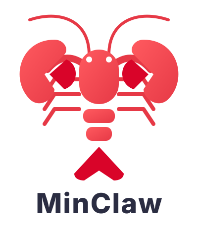
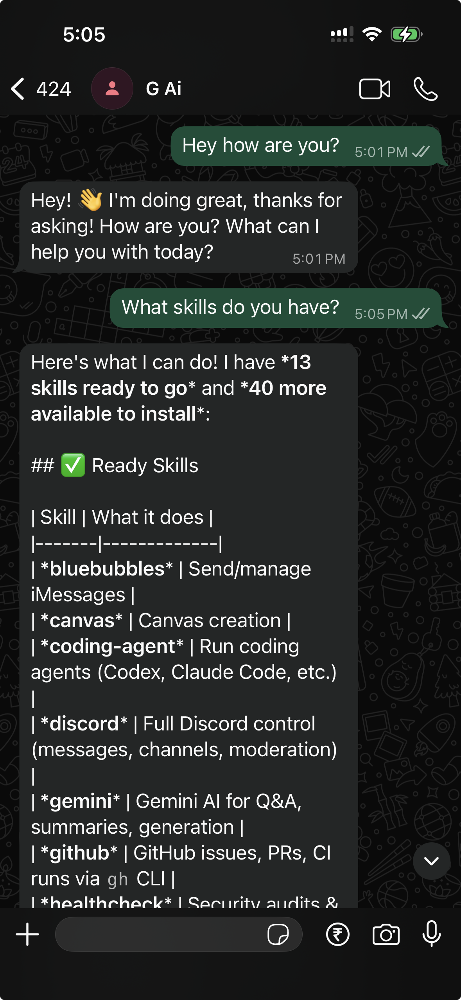
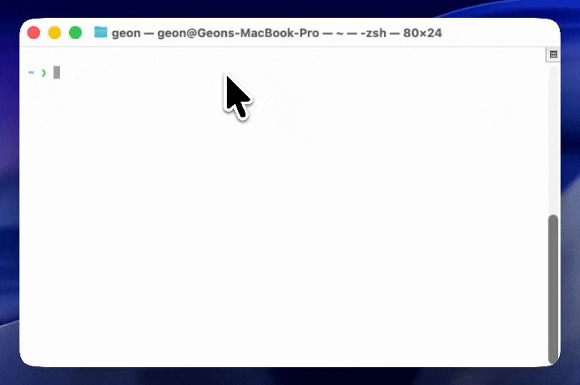
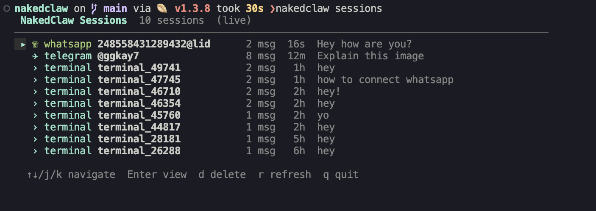

<p align="center">
  
</p>

# MinClaw

**Your own personal AI assistant. AI that rewrites itself.**

MinClaw is a self-improving AI agent that runs as a background daemon on your machine. Chat with it from your terminal, WhatsApp, Telegram, or Slack — and it can edit its own source code to add features, fix bugs, and grow.

<p align="center">
  <br/>
Nakedclaw in Whatsapp
</p>

## Why MinClaw?

[OpenClaw](https://github.com/openclaw/openclaw) is great, but it's wearing a lot of clothes:

- A **macOS app** (204 Swift files, code signing, notarization, DMG packaging)
- An **iOS app** (28 Swift files, Xcode provisioning)
- An **Android app** (63 Kotlin files, Gradle build)
- A **web dashboard** (113 files, Lit components, Vite, Playwright)
- **127 npm dependencies** including sharp, pdfjs, playwright, AWS Bedrock SDK
- **617 documentation files** + a full Chinese translation pipeline
- **7 CI/CD workflows**, Docker images, 50+ release scripts
- **451,926 lines of code** across 2,581 files

MinClaw strips all of that away. No Mac app. No web server. No mobile apps. No 32 channel plugins. No Docker. No CI. Just a daemon, a CLI, and two messaging channels. ~3,000 lines of TypeScript.

All the good functionality. None of the clothes. Truly naked.

## Features

- **Memory** — chat history is saved in `memory/chats/*.md` and indexed in `memory/temporary-memory.md`; persistent user/project facts live in `brain/permanent-memory.md` and are loaded every session
- **Heartbeat** — configurable cron that triggers the agent periodically
- **Scheduler** — natural language scheduling ("remind me at 10", "every day at 9am")
- **Multiple terminals** — open as many `minclaw` sessions as you want
- **Config hot-reload** — edit `minclaw.json5` and heartbeat/scheduler update automatically
- **Model Fallbacks** — configure backup models in `minclaw.json5`; if the primary model fails, MinClaw automatically retries with the next one
- **Web UI** — manage sessions, config, skills, and scheduled jobs from a modern browser interface
- **Web Search & Fetch** — built-in tools for searching the web (via SearXNG) and fetching page content directly. Requires a running SearXNG instance.

### Setting up SearXNG

The easiest way to run SearXNG is via Docker:

```bash
docker run -d -p 8080:8080 -v "$(pwd)/searxng:/etc/searxng" \
  -e "SEARXNG_SETTINGS_PATH=/etc/searxng/settings.yml" \
  searxng/searxng:latest
```

For a setup with Docker Compose, follow the [Official SearXNG Installation Guide](https://docs.searxng.org/admin/installation-docker.html).

Once running, MinClaw defaults to `http://localhost:8080`. You can customize this by setting `SEARXNG_BASE_URL` in your `.env` file.

- **Usage Summaries** — token usage and estimated cost breakdown for every interaction
- **Skills** — MinClaw reaches its long, naked claw into the [openclaw](https://github.com/openclaw/openclaw) skill catalog and shamelessly steals every single skill. 100% compatible with all openclaw skills — you can even create your own specialized skills to teach MinClaw new tricks, or simply **ask MinClaw to create a skill for you** during a conversation.

<p align="center">
  <br/>
  Access it via the terminal
</p>

## Web UI

MinClaw includes a full-featured dashboard for a more visual management experience:

```bash
bun run web
```

By default, the dashboard is available at `http://localhost:8787`. Features include:
- **Live Chat** — chat with the agent directly in the browser
- **Session Browser** — view history and active sessions from all channels
- **Config Editor** — hot-edit your `minclaw.json5` configuration
- **Skill Manager** — browse, sync, and install skills with a single click
- **Job Manager** — view and cancel scheduled tasks and heartbeats
- **Memory Search** — search through all indexed past conversations

## Quick start

```bash
bun install
bun link

minclaw setup     # authenticate (Anthropic or OpenAI)
minclaw start     # start the daemon
minclaw           # chat
```

## Auth

MinClaw supports multiple authentication methods:

**Anthropic:**
- **Setup token** (recommended) — run `claude setup-token` in another terminal and paste the result
- **API key** — paste your `sk-ant-api03-...` key directly

**OpenAI:**
- **API key** — paste your `sk-...` key
- **Codex** (ChatGPT subscription) — browser-based OAuth login, no API key needed

**GitHub Copilot:**
- **OAuth** (subscription) — browser-based login via `minclaw setup`. Use your existing GitHub Copilot subscription as a powerful, free-ish backend.

**Ollama:**
- **Local models** — use the OpenAI-compatible endpoint (default `http://localhost:11434/v1`)
- **Base URL** — set `model.baseUrl` in `minclaw.json5` (optional if using default)
- **Token** — optional; save with `minclaw setup` or set `OLLAMA_API_KEY`
- **Select model** — `minclaw models set ollama/<model>` (free-form)

## CLI

```
minclaw              chat with the agent
minclaw setup        authenticate (Anthropic, OpenAI, or GitHub Copilot)
minclaw models       interactive model/provider picker
minclaw models set <provider>/<model>  set model directly
minclaw start        start the background daemon (use --verbose for LLM logs)
minclaw stop         stop the daemon
minclaw restart      restart the daemon (use --verbose for LLM logs)
minclaw status       show daemon status
minclaw logs         tail daemon logs
minclaw sessions     interactive session browser (live TUI)

minclaw skills       list skills with eligibility
minclaw skills sync  fetch skill catalog from GitHub
minclaw skills install <name>  install a skill's deps
minclaw skills info <name>     show skill details
minclaw help         show help

## Creating Your Own Skills

Skills are modular packages that extend MinClaw's capabilities. A skill lives in its own directory within `skills/` and consists of:

- `SKILL.md` (required): Contains YAML frontmatter (name/description) and Markdown instructions.
- `scripts/` (optional): Executable scripts (Python, Bash, etc.) the agent can run.
- `references/` (optional): Documentation or data files the agent can read.
- `assets/` (optional): Templates or static files the agent can use.

### Anatomy of `SKILL.md`

```markdown
---
name: my-cool-skill
description: Comprehensive description of when the agent should use this skill.
---

# My Cool Skill

Instructions for the agent on how to use the scripts and resources in this skill.
```

The **description** in the frontmatter is the primary way MinClaw decides when to trigger your skill. Be specific!

### Ask MinClaw to Create One

Since MinClaw can edit its own code, it can also create skills for you. Just ask:
> "Create a skill that helps me manage my local Docker containers using specialized scripts."

To manually create a new skill, simply create a new folder in `skills/` with a `SKILL.md` file. MinClaw will pick it up automatically.

<p align="center">
  <br/>
  Manage and view sessions in terminal
</p>

## Channels

**Terminal** is always available — just run `minclaw`. For messaging channels, use the connect wizard:

### WhatsApp

```bash
minclaw connect wa
```

Walks you through it — enables WhatsApp in config, shows a QR code, you scan it, done. Auth is saved in `.wa-auth/` so you only scan once. Reconnects automatically.

### Telegram

```bash
minclaw connect tg
```

Prompts for your bot token (get one from [@BotFather](https://t.me/BotFather) — send `/newbot`). Verifies the token, enables Telegram in config, and offers to save the token to `.env`. Then just `minclaw restart`.

### Slack

```bash
minclaw connect slack
```

Prompts for your Bot Token (`xoxb-...`) and App Token (`xapp-...`). To get these:

1. Create an app at [api.slack.com/apps](https://api.slack.com/apps)
2. Enable **Socket Mode** (gives you the `xapp-` token)
3. Add Bot Token Scopes: `chat:write`, `app_mentions:read`, `im:history`, `im:read`, `im:write`
4. Install to workspace (gives you the `xoxb-` token)

The wizard verifies both tokens, enables Slack in config, and saves to `.env`.

### Access control

Each channel has an `allowFrom` list in `minclaw.json5`. Leave it empty to allow everyone, or restrict:

```json5
"telegram": { "enabled": true, "allowFrom": ["@yourusername"] }
"whatsapp": { "enabled": true, "allowFrom": ["+1234567890"] }
```

## Architecture

```
~/.minclaw/           state directory
  credentials.json      auth credentials
  daemon.pid            PID file
  daemon.sock           Unix socket (daemon <-> CLI)
  logs/daemon.log       daemon logs

minclaw.json5         project config
skills/                 stolen openclaw skills (cached locally)
sessions/               JSONL transcripts per sender
memory/                 markdown chat history + temporary-memory.md index
public/web/             Web UI dashboard assets
```

Daemon runs in background. CLI clients connect via Unix socket using NDJSON protocol. Multiple terminals supported simultaneously.
